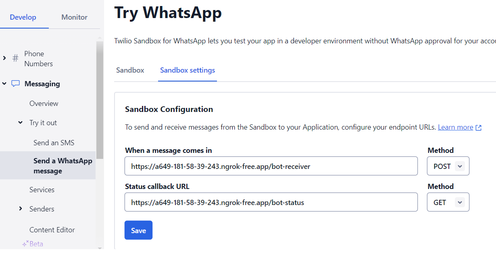

# Welcome to Ailyn


**Ailyn** is a simple open-source virtual sales agent that uses **Retrieval Augmented Generation** (**RAG**) techniques to provide customer service and sales on various platforms such as WhatsApp and Telegram. All the **RAG** functionality was written from scratch, so there are **no dependencies** on libraries like LangChaing or LlamaIndex.

If you are new to RAG, you can use Ailyn to learn how to implement the main components of a "ChapGPT on your private data" application, including document embedding, retrieval, LLM response caching, and more.


## Features and dependencies

1. **OpenAI API**: Ailyn uses OpenAI APIs to provide the functionality of question answering and embeddings.
2. **Qdrant Vectorial Database**: This project uses Qdrant, a flexible, high-performance vector database.
3. **OpenAI Whisper**: Ailyn works with OpenAI Whisper for automated voice-to-text processing.
4. **LLM Responses Caching**: This functionality allows better response times and reduces operational costs.

Before starting, you must install Whisper following the instructions here: https://github.com/openai/whisper

   
## Getting Started

To start using Ailyn, clone this repository and install all the required dependencies.

Once you have cloned the repository change to the project's root folder by typing **cd ailyn**

### Processing your documents

Ailyn allows users to chat with your private data through WhatsApp and Telegram. So, the first step to get Ailyn working is to 'index' (get vector embeddings) your documents so the agent can start answering questions about your data.

By default, the system supports documents in **.pdf**, **.docx**, and **.txt** format.

So, put all your documents in a folder and (assuming you are in the Ailyn root directory) run the following command in your terminal:

**python ./src/document_loader.py [env_filepath] data_folder**

Example:

```
/home/mydata
    catalog.docx
    return_policies.pdf
    guarantee.pdf
```    

**python document_loader.py /home/mydata**

The **env_filepath** configuration file is optional because, by default, the system will look for an env.txt file in the current path.

The following is the structure of the env.txt file:

```
query_cache_collection = query_cache
rag_collection         = ailyn_qa
rag_vector_dimension   = 1536
st_model               = sentence-transformers/stsb-xlm-r-multilingual
rag_prompt_filepath    = /home/ailyn/prompts/sales_agent.txt
qdrant_connection      = url|localhost
telegram_bot_token     = your telegram token
twilio_account_sid     = your twilio_account_sid
twilio_auth_token      = your twilio_auth_token
cache_vector_dimension = 768
open_ai_key            = your open_ai key
query_validation_filepath  = /home/ailyn/prompts/validation.json
welcome_filepath       = /home/ailyn/prompts/welcome.txt
help_filepath          = /home/ailyn/prompts/help.txt
tmp_audio_folder       = /home/ailyn/tmp
whatsapp_api_port      = 8080
```

#### Start playing around with RAG using the sample documents.

The project comes with a set of informational documents (In Spanish :) ) from a fictional Logistics agency called FlexLogistics. You can start playing around with Ailyn loading those documents running this command:

**python /src/document_loader.py ./data**

After that, you can start the WhatsApp, telegram, or command-line interface and issue questions like:

- What are the shipping prices for general cargo?
- What are the prices for refrigerated cargo?
- Which ports do you arrive at in China?
- Can I work with you?
- Do you have corporate plans? 
- Give me a summary of the corporate plan, including prices.


### Launching Ailyn agent interfaces


**To launch the WhatsApp agent type:**

python whatsapp_interface.py [env file path] 

**To launch the Telegram bot type:**

python telegram_interface.py [env file path]


## References


### Whatsapp - Twilio

Ailyn uses the **Twilio WhatsApp API** to expose a virtual agent through WhatsApp. So, you must create a Twilio Account (this is free) to obtain your account SID and auth Token. Once you get your credentials, put them in the env.txt file.

```
twilio_account_sid     = your twilio_account_sid
twilio_auth_token      = your twilio_auth_token
```

Now, you can test your WhatsApp agent in the Twilio sandbox. Note that the Ailyn WhatsApp web interface must be accessible through the Internet. So you must host Ailyn in the cloud or use **ngrok** to expose your local instance. 

Once your Ailyn WhatsApp interface is public, you can set up the Twilio Sandbox: 




### Telegram

Here, you can find general information about Telegram Bots, including how to get your Telegram bot token.

https://core.telegram.org/bots/tutorial

Once you get your bot token, put it in the env.txt file.

```
telegram_bot_token     = your telegram token
```


## Contributing

As an open-source project, we would love for you to contribute. If you are interested in helping, check out our contribution guide to understand how you can contribute.

You can show your support by giving a star to this project.

## License 

This project is under the Apache 2 License.

## Contact

For more information about the project, contact the development team, or if you have any questions, don't hesitate to contact me at carlosortizur@gmail.com.